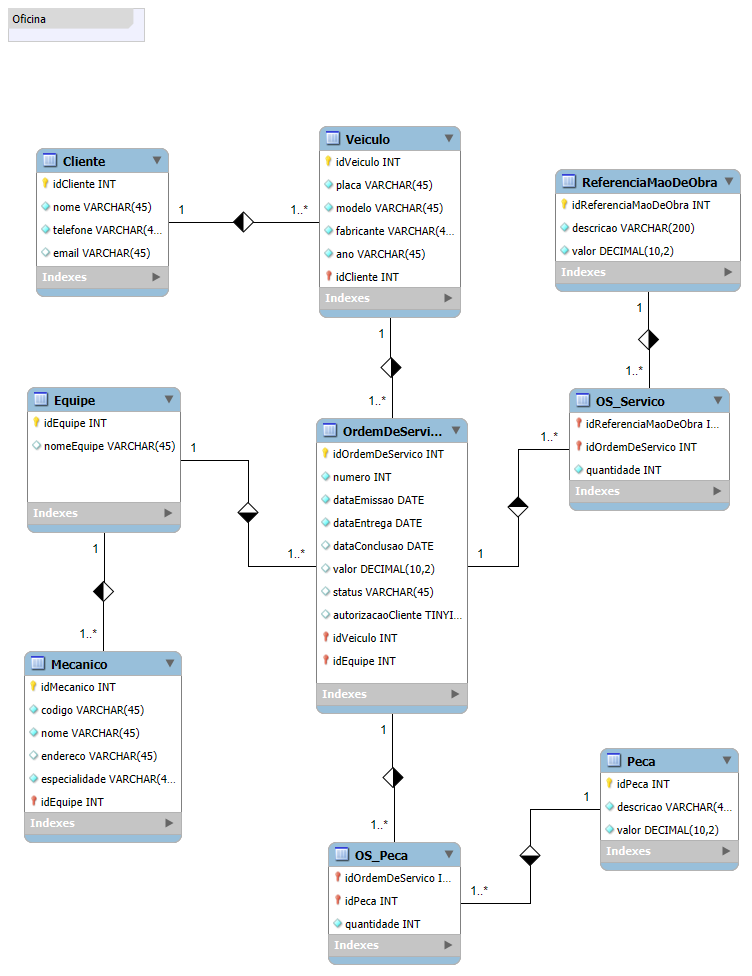

<a href="https://dio.me/">

# Criando um esquema conceitual para o contexto de oficina

 > ℹ️ **NOTE:** Este repositório foi desenvolvido durante o desafio do bootcamp Heineken - Inteligência Artificial Aplicada a Dados com Copilot, em parceria com a [DIO](https://dio.me)

Narrativa:
  - Sistema de controle e gerenciamento de execução de ordens de serviço em uma oficina mecânica;
  - Clientes levam veículos à oficina mecânica para serem consertados ou para passarem por revisões  periódicas;
  - Cada veículo é designado a uma equipe de mecânicos que identifica os serviços a serem executados e preenche uma OS com data de entrega;
  - A partir da OS, calcula-se o valor de cada serviço, consultando-se uma tabela de referência de mão-de-obra
  - O valor de cada peça também irá compor a OS
  - O cliente autoriza a execução dos serviços
  - A mesma equipe avalia e executa os serviços
  - Os mecânicos possuem código, nome, endereço e especialidade
  - Cada OS possui: n°, data de emissão, um valor, status e uma data para conclusão dos trabalhos.

Durante o desafio, utilizei os conhecimentos adquiridos para modelagem, garantindo maior organização e desempenho na manipulação dos dados.

## 💻 Tecnologias utilizadas no projeto

- [MySQL Workbench](https://www.mysql.com/products/workbench/)

## ✨ Como foi feito ?

- Modelagem criada no Workbench.

## 📚 Materiais
- [MySQL Workbench](https://www.mysql.com/products/workbench/)

## 🛠️ Instruções de execução

Utilize ferramentas especializadas para modelagem de dados, como `draw.io`, `MySQL Workbench` ou `DB Designer.net`. Aplique seus conhecimentos para criar uma modelagem eficiente, sempre seguindo as melhores práticas.

## 🚀 Resultados
Este desafio proporcionou uma experiência prática de como na modelar os dados para um projeto real. O MySQL Workbench, por exemplo, permite exportar a modelagem diretamente para SQL, facilitando a criação do banco de dados e das tabelas.

- [Oficina](/src/Oficina.mwb)

## 📝 Código SQL

~~~SQL
-- MySQL Script generated by MySQL Workbench
-- Thu Mar  6 13:25:44 2025
-- Model: New Model    Version: 1.0
-- MySQL Workbench Forward Engineering

SET @OLD_UNIQUE_CHECKS=@@UNIQUE_CHECKS, UNIQUE_CHECKS=0;
SET @OLD_FOREIGN_KEY_CHECKS=@@FOREIGN_KEY_CHECKS, FOREIGN_KEY_CHECKS=0;
SET @OLD_SQL_MODE=@@SQL_MODE, SQL_MODE='ONLY_FULL_GROUP_BY,STRICT_TRANS_TABLES,NO_ZERO_IN_DATE,NO_ZERO_DATE,ERROR_FOR_DIVISION_BY_ZERO,NO_ENGINE_SUBSTITUTION';

-- -----------------------------------------------------
-- Schema oficina
-- -----------------------------------------------------

-- -----------------------------------------------------
-- Schema oficina
-- -----------------------------------------------------
CREATE SCHEMA IF NOT EXISTS `oficina` DEFAULT CHARACTER SET utf8 ;
USE `oficina` ;

-- -----------------------------------------------------
-- Table `oficina`.`Cliente`
-- -----------------------------------------------------
CREATE TABLE IF NOT EXISTS `oficina`.`Cliente` (
  `idCliente` INT NOT NULL AUTO_INCREMENT,
  `nome` VARCHAR(45) NOT NULL,
  `telefone` VARCHAR(45) NOT NULL,
  `email` VARCHAR(45) NULL,
  PRIMARY KEY (`idCliente`))
ENGINE = InnoDB;

-- -----------------------------------------------------
-- Table `oficina`.`Veiculo`
-- -----------------------------------------------------
CREATE TABLE IF NOT EXISTS `oficina`.`Veiculo` (
  `idVeiculo` INT NOT NULL AUTO_INCREMENT,
  `placa` VARCHAR(45) NOT NULL,
  `modelo` VARCHAR(45) NOT NULL,
  `fabricante` VARCHAR(45) NOT NULL,
  `ano` VARCHAR(45) NOT NULL,
  `idCliente` INT NOT NULL,
  PRIMARY KEY (`idVeiculo`, `idCliente`),
  INDEX `fk_Veiculo_Cliente_idx` (`idCliente` ASC) VISIBLE,
  UNIQUE INDEX `placa_UNIQUE` (`placa` ASC) VISIBLE,
  CONSTRAINT `fk_Veiculo_Cliente`
    FOREIGN KEY (`idCliente`)
    REFERENCES `oficina`.`Cliente` (`idCliente`)
    ON DELETE NO ACTION
    ON UPDATE NO ACTION)
ENGINE = InnoDB;

-- -----------------------------------------------------
-- Table `oficina`.`Equipe`
-- -----------------------------------------------------
CREATE TABLE IF NOT EXISTS `oficina`.`Equipe` (
  `idEquipe` INT NOT NULL AUTO_INCREMENT,
  `nomeEquipe` VARCHAR(45) NULL,
  PRIMARY KEY (`idEquipe`))
ENGINE = InnoDB;

-- -----------------------------------------------------
-- Table `oficina`.`OrdemDeServico`
-- -----------------------------------------------------
CREATE TABLE IF NOT EXISTS `oficina`.`OrdemDeServico` (
  `idOrdemDeServico` INT NOT NULL AUTO_INCREMENT,
  `numero` INT NOT NULL,
  `dataEmissao` DATE NOT NULL,
  `dataEntrega` DATE NOT NULL,
  `dataConclusao` DATE NULL,
  `valor` DECIMAL(10,2) NULL,
  `status` VARCHAR(45) NULL,
  `autorizacaoCliente` TINYINT NULL,
  `idVeiculo` INT NOT NULL,
  `idEquipe` INT NOT NULL,
  PRIMARY KEY (`idOrdemDeServico`, `idVeiculo`, `idEquipe`),
  INDEX `fk_OrdemDeServico_Veiculo1_idx` (`idVeiculo` ASC) VISIBLE,
  UNIQUE INDEX `numero_UNIQUE` (`numero` ASC) VISIBLE,
  INDEX `fk_OrdemDeServico_Equipe1_idx` (`idEquipe` ASC) VISIBLE,
  CONSTRAINT `fk_OrdemDeServico_Veiculo1`
    FOREIGN KEY (`idVeiculo`)
    REFERENCES `oficina`.`Veiculo` (`idVeiculo`)
    ON DELETE NO ACTION
    ON UPDATE NO ACTION,
  CONSTRAINT `fk_OrdemDeServico_Equipe1`
    FOREIGN KEY (`idEquipe`)
    REFERENCES `oficina`.`Equipe` (`idEquipe`)
    ON DELETE NO ACTION
    ON UPDATE NO ACTION)
ENGINE = InnoDB;

-- -----------------------------------------------------
-- Table `oficina`.`Mecanico`
-- -----------------------------------------------------
CREATE TABLE IF NOT EXISTS `oficina`.`Mecanico` (
  `idMecanico` INT NOT NULL AUTO_INCREMENT,
  `codigo` VARCHAR(45) NOT NULL,
  `nome` VARCHAR(45) NOT NULL,
  `endereco` VARCHAR(45) NULL,
  `especialidade` VARCHAR(45) NOT NULL,
  `idEquipe` INT NOT NULL,
  PRIMARY KEY (`idMecanico`, `idEquipe`),
  INDEX `fk_Mecanico_Equipe1_idx` (`idEquipe` ASC) VISIBLE,
  UNIQUE INDEX `codigo_UNIQUE` (`codigo` ASC) VISIBLE,
  CONSTRAINT `fk_Mecanico_Equipe1`
    FOREIGN KEY (`idEquipe`)
    REFERENCES `oficina`.`Equipe` (`idEquipe`)
    ON DELETE NO ACTION
    ON UPDATE NO ACTION)
ENGINE = InnoDB;

-- -----------------------------------------------------
-- Table `oficina`.`Peca`
-- -----------------------------------------------------
CREATE TABLE IF NOT EXISTS `oficina`.`Peca` (
  `idPeca` INT NOT NULL AUTO_INCREMENT,
  `descricao` VARCHAR(45) NOT NULL,
  `valor` DECIMAL(10,2) NOT NULL,
  PRIMARY KEY (`idPeca`))
ENGINE = InnoDB;

-- -----------------------------------------------------
-- Table `oficina`.`ReferenciaMaoDeObra`
-- -----------------------------------------------------
CREATE TABLE IF NOT EXISTS `oficina`.`ReferenciaMaoDeObra` (
  `idReferenciaMaoDeObra` INT NOT NULL AUTO_INCREMENT,
  `descricao` VARCHAR(200) NOT NULL,
  `valor` DECIMAL(10,2) NOT NULL,
  PRIMARY KEY (`idReferenciaMaoDeObra`))
ENGINE = InnoDB;

-- -----------------------------------------------------
-- Table `oficina`.`OS_Servico`
-- -----------------------------------------------------
CREATE TABLE IF NOT EXISTS `oficina`.`OS_Servico` (
  `idReferenciaMaoDeObra` INT NOT NULL,
  `idOrdemDeServico` INT NOT NULL,
  `quantidade` INT NOT NULL,
  PRIMARY KEY (`idReferenciaMaoDeObra`, `idOrdemDeServico`),
  INDEX `fk_ReferenciaMaoDeObra_has_OrdemDeServico_OrdemDeServico1_idx` (`idOrdemDeServico` ASC) VISIBLE,
  INDEX `fk_ReferenciaMaoDeObra_has_OrdemDeServico_ReferenciaMaoDeOb_idx` (`idReferenciaMaoDeObra` ASC) VISIBLE,
  CONSTRAINT `fk_ReferenciaMaoDeObra_has_OrdemDeServico_ReferenciaMaoDeObra1`
    FOREIGN KEY (`idReferenciaMaoDeObra`)
    REFERENCES `oficina`.`ReferenciaMaoDeObra` (`idReferenciaMaoDeObra`)
    ON DELETE NO ACTION
    ON UPDATE NO ACTION,
  CONSTRAINT `fk_ReferenciaMaoDeObra_has_OrdemDeServico_OrdemDeServico1`
    FOREIGN KEY (`idOrdemDeServico`)
    REFERENCES `oficina`.`OrdemDeServico` (`idOrdemDeServico`)
    ON DELETE NO ACTION
    ON UPDATE NO ACTION)
ENGINE = InnoDB;

-- -----------------------------------------------------
-- Table `oficina`.`OS_Peca`
-- -----------------------------------------------------
CREATE TABLE IF NOT EXISTS `oficina`.`OS_Peca` (
  `idOrdemDeServico` INT NOT NULL,
  `idPeca` INT NOT NULL,
  `quantidade` INT NOT NULL,
  PRIMARY KEY (`idOrdemDeServico`, `idPeca`),
  INDEX `fk_OrdemDeServico_has_Peca_Peca1_idx` (`idPeca` ASC) VISIBLE,
  INDEX `fk_OrdemDeServico_has_Peca_OrdemDeServico1_idx` (`idOrdemDeServico` ASC) VISIBLE,
  CONSTRAINT `fk_OrdemDeServico_has_Peca_OrdemDeServico1`
    FOREIGN KEY (`idOrdemDeServico`)
    REFERENCES `oficina`.`OrdemDeServico` (`idOrdemDeServico`)
    ON DELETE NO ACTION
    ON UPDATE NO ACTION,
  CONSTRAINT `fk_OrdemDeServico_has_Peca_Peca1`
    FOREIGN KEY (`idPeca`)
    REFERENCES `oficina`.`Peca` (`idPeca`)
    ON DELETE NO ACTION
    ON UPDATE NO ACTION)
ENGINE = InnoDB;

SET SQL_MODE=@OLD_SQL_MODE;
SET FOREIGN_KEY_CHECKS=@OLD_FOREIGN_KEY_CHECKS;
SET UNIQUE_CHECKS=@OLD_UNIQUE_CHECKS;

~~~

## 👨‍💻 Expert

    
    
&nbsp&nbsp&nbspFelipe M Ferreira 
    &nbsp&nbsp&nbsp
    <a href="https://github.com/felipeb2a">
    GitHub</a>&nbsp;|&nbsp;
    <a href="https://www.linkedin.com/in/felipe-marques-ti/">LinkedIn</a>
&nbsp;|&nbsp;
    <a href="https://www.instagram.com/felipeb2a/">
    Instagram</a>
&nbsp;|&nbsp;

  

---

⌨️ com 💜 por [Felipe M Ferreira](https://github.com/felipeb2a)